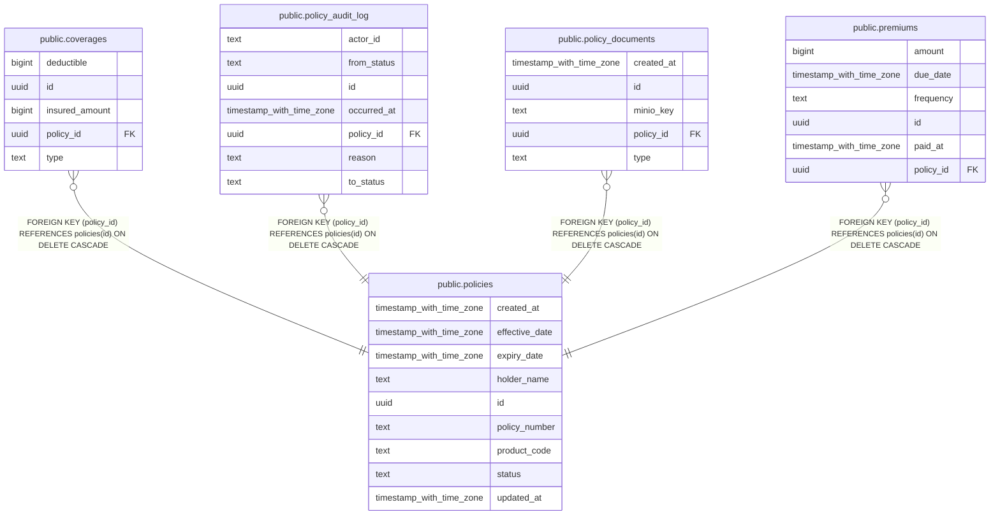

# ktayl_policy

## Tables

| Name                                                  | Columns | Comment | Type       |
| ----------------------------------------------------- | ------- | ------- | ---------- |
| [public.coverages](public.coverages.md)               | 5       |         | BASE TABLE |
| [public.policies](public.policies.md)                 | 9       |         | BASE TABLE |
| [public.policy_audit_log](public.policy_audit_log.md) | 7       |         | BASE TABLE |
| [public.policy_documents](public.policy_documents.md) | 5       |         | BASE TABLE |
| [public.premiums](public.premiums.md)                 | 6       |         | BASE TABLE |

## Stored procedures and functions

| Name                      | ReturnType | Arguments                 | Type     |
| ------------------------- | ---------- | ------------------------- | -------- |
| public.uuid_generate_v1   | uuid       |                           | FUNCTION |
| public.uuid_generate_v1mc | uuid       |                           | FUNCTION |
| public.uuid_generate_v3   | uuid       | namespace uuid, name text | FUNCTION |
| public.uuid_generate_v4   | uuid       |                           | FUNCTION |
| public.uuid_generate_v5   | uuid       | namespace uuid, name text | FUNCTION |
| public.uuid_nil           | uuid       |                           | FUNCTION |
| public.uuid_ns_dns        | uuid       |                           | FUNCTION |
| public.uuid_ns_oid        | uuid       |                           | FUNCTION |
| public.uuid_ns_url        | uuid       |                           | FUNCTION |
| public.uuid_ns_x500       | uuid       |                           | FUNCTION |

## Relations

---

> Generated by [tbls](https://github.com/k1LoW/tbls)
