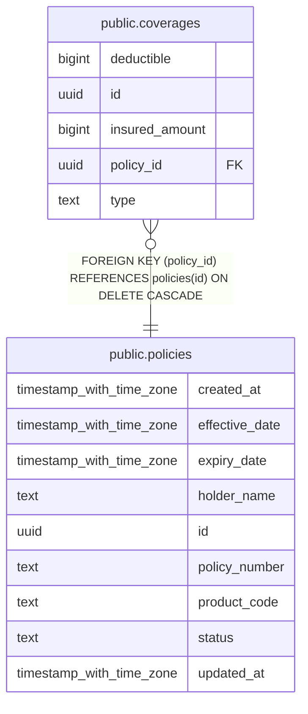

# public.coverages

## Columns

| Name           | Type   | Default            | Nullable | Children | Parents                               | Comment |
| -------------- | ------ | ------------------ | -------- | -------- | ------------------------------------- | ------- |
| deductible     | bigint | 0                  | false    |          |                                       |         |
| id             | uuid   | uuid_generate_v4() | false    |          |                                       |         |
| insured_amount | bigint |                    | false    |          |                                       |         |
| policy_id      | uuid   |                    | false    |          | [public.policies](public.policies.md) |         |
| type           | text   |                    | false    |          |                                       |         |

## Constraints

| Name                     | Type        | Definition                                                        |
| ------------------------ | ----------- | ----------------------------------------------------------------- |
| chk_deductible           | CHECK       | CHECK ((deductible >= 0))                                         |
| chk_insured_amount       | CHECK       | CHECK ((insured_amount > 0))                                      |
| coverages_pkey           | PRIMARY KEY | PRIMARY KEY (id)                                                  |
| coverages_policy_id_fkey | FOREIGN KEY | FOREIGN KEY (policy_id) REFERENCES policies(id) ON DELETE CASCADE |

## Indexes

| Name                    | Definition                                                                       |
| ----------------------- | -------------------------------------------------------------------------------- |
| coverages_pkey          | CREATE UNIQUE INDEX coverages_pkey ON public.coverages USING btree (id)          |
| idx_coverages_policy_id | CREATE INDEX idx_coverages_policy_id ON public.coverages USING btree (policy_id) |

## Relations

---

> Generated by [tbls](https://github.com/k1LoW/tbls)
