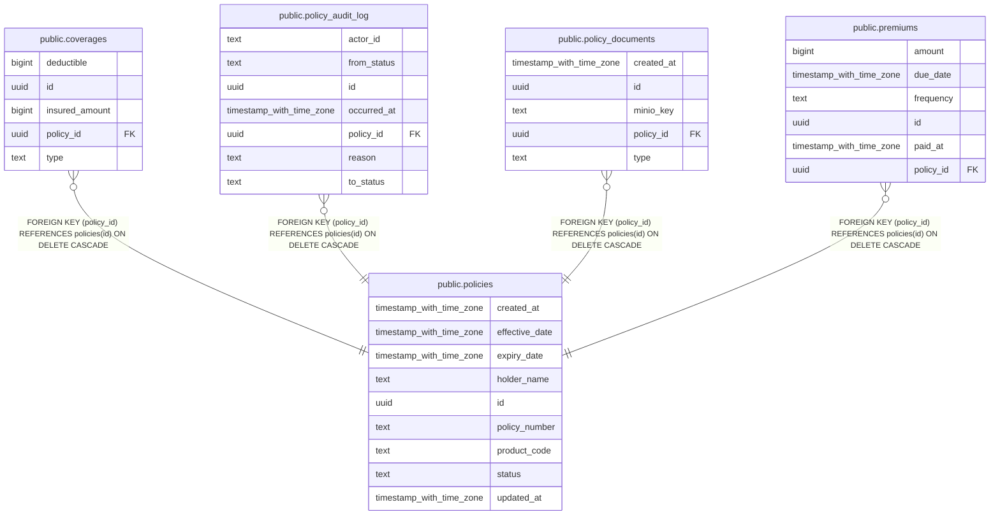

# public.policies

## Columns

| Name           | Type                     | Default            | Nullable | Children                                                                                                                                                                                  | Parents | Comment |
| -------------- | ------------------------ | ------------------ | -------- | ----------------------------------------------------------------------------------------------------------------------------------------------------------------------------------------- | ------- | ------- |
| created_at     | timestamp with time zone | now()              | false    |                                                                                                                                                                                           |         |         |
| effective_date | timestamp with time zone |                    | false    |                                                                                                                                                                                           |         |         |
| expiry_date    | timestamp with time zone |                    | false    |                                                                                                                                                                                           |         |         |
| holder_name    | text                     |                    | false    |                                                                                                                                                                                           |         |         |
| id             | uuid                     | uuid_generate_v4() | false    | [public.coverages](public.coverages.md) [public.policy_audit_log](public.policy_audit_log.md) [public.policy_documents](public.policy_documents.md) [public.premiums](public.premiums.md) |         |         |
| policy_number  | text                     |                    | false    |                                                                                                                                                                                           |         |         |
| product_code   | text                     |                    | false    |                                                                                                                                                                                           |         |         |
| status         | text                     | 'draft'::text      | false    |                                                                                                                                                                                           |         |         |
| updated_at     | timestamp with time zone | now()              | false    |                                                                                                                                                                                           |         |         |

## Constraints

| Name                       | Type        | Definition                                                                                                                                                                                     |
| -------------------------- | ----------- | ---------------------------------------------------------------------------------------------------------------------------------------------------------------------------------------------- |
| chk_policy_dates           | CHECK       | CHECK ((effective_date < expiry_date))                                                                                                                                                         |
| policies_pkey              | PRIMARY KEY | PRIMARY KEY (id)                                                                                                                                                                               |
| policies_policy_number_key | UNIQUE      | UNIQUE (policy_number)                                                                                                                                                                         |
| policies_status_check      | CHECK       | CHECK ((status = ANY (ARRAY['draft'::text, 'submitted'::text, 'active'::text, 'rejected'::text, 'amended'::text, 'cancelled'::text, 'expired'::text, 'suspended'::text, 'terminated'::text]))) |

## Indexes

| Name                       | Definition                                                                                    |
| -------------------------- | --------------------------------------------------------------------------------------------- |
| idx_policies_policy_number | CREATE INDEX idx_policies_policy_number ON public.policies USING btree (policy_number)        |
| idx_policies_status        | CREATE INDEX idx_policies_status ON public.policies USING btree (status)                      |
| policies_pkey              | CREATE UNIQUE INDEX policies_pkey ON public.policies USING btree (id)                         |
| policies_policy_number_key | CREATE UNIQUE INDEX policies_policy_number_key ON public.policies USING btree (policy_number) |

## Relations

---

> Generated by [tbls](https://github.com/k1LoW/tbls)
