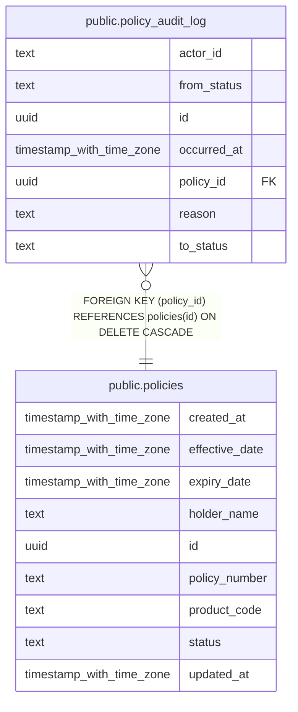

# public.policy_audit_log

## Columns

| Name        | Type                     | Default           | Nullable | Children | Parents                               | Comment |
| ----------- | ------------------------ | ----------------- | -------- | -------- | ------------------------------------- | ------- |
| actor_id    | text                     |                   | false    |          |                                       |         |
| from_status | text                     |                   | false    |          |                                       |         |
| id          | uuid                     | gen_random_uuid() | false    |          |                                       |         |
| occurred_at | timestamp with time zone | now()             | false    |          |                                       |         |
| policy_id   | uuid                     |                   | false    |          | [public.policies](public.policies.md) |         |
| reason      | text                     | ''::text          | false    |          |                                       |         |
| to_status   | text                     |                   | false    |          |                                       |         |

## Constraints

| Name                            | Type        | Definition                                                        |
| ------------------------------- | ----------- | ----------------------------------------------------------------- |
| policy_audit_log_pkey           | PRIMARY KEY | PRIMARY KEY (id)                                                  |
| policy_audit_log_policy_id_fkey | FOREIGN KEY | FOREIGN KEY (policy_id) REFERENCES policies(id) ON DELETE CASCADE |

## Indexes

| Name                    | Definition                                                                                                |
| ----------------------- | --------------------------------------------------------------------------------------------------------- |
| idx_audit_log_policy_id | CREATE INDEX idx_audit_log_policy_id ON public.policy_audit_log USING btree (policy_id, occurred_at DESC) |
| policy_audit_log_pkey   | CREATE UNIQUE INDEX policy_audit_log_pkey ON public.policy_audit_log USING btree (id)                     |

## Relations

---

> Generated by [tbls](https://github.com/k1LoW/tbls)
