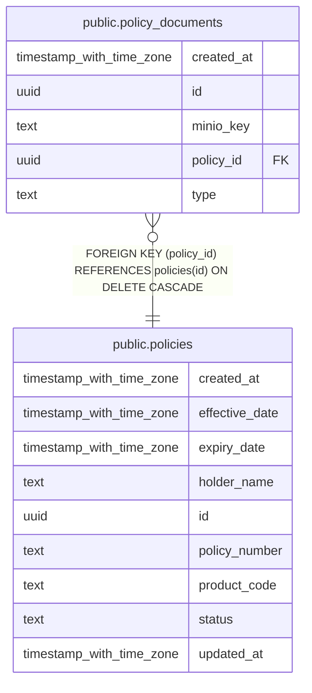

# public.policy_documents

## Columns

| Name       | Type                     | Default             | Nullable | Children | Parents                               | Comment |
| ---------- | ------------------------ | ------------------- | -------- | -------- | ------------------------------------- | ------- |
| created_at | timestamp with time zone | now()               | false    |          |                                       |         |
| id         | uuid                     | gen_random_uuid()   | false    |          |                                       |         |
| minio_key  | text                     |                     | false    |          |                                       |         |
| policy_id  | uuid                     |                     | false    |          | [public.policies](public.policies.md) |         |
| type       | text                     | 'attestation'::text | false    |          |                                       |         |

## Constraints

| Name                            | Type        | Definition                                                        |
| ------------------------------- | ----------- | ----------------------------------------------------------------- |
| policy_documents_pkey           | PRIMARY KEY | PRIMARY KEY (id)                                                  |
| policy_documents_policy_id_fkey | FOREIGN KEY | FOREIGN KEY (policy_id) REFERENCES policies(id) ON DELETE CASCADE |

## Indexes

| Name                           | Definition                                                                                                      |
| ------------------------------ | --------------------------------------------------------------------------------------------------------------- |
| idx_policy_documents_policy_id | CREATE INDEX idx_policy_documents_policy_id ON public.policy_documents USING btree (policy_id, created_at DESC) |
| policy_documents_pkey          | CREATE UNIQUE INDEX policy_documents_pkey ON public.policy_documents USING btree (id)                           |

## Relations

---

> Generated by [tbls](https://github.com/k1LoW/tbls)
