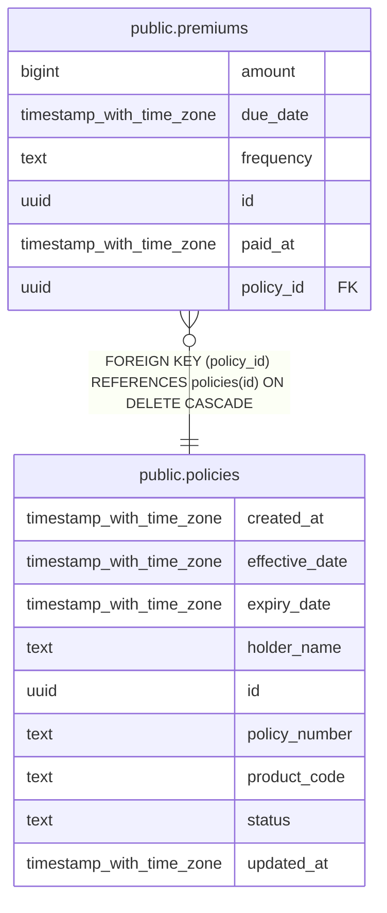

# public.premiums

## Columns

| Name      | Type                     | Default            | Nullable | Children | Parents                               | Comment |
| --------- | ------------------------ | ------------------ | -------- | -------- | ------------------------------------- | ------- |
| amount    | bigint                   |                    | false    |          |                                       |         |
| due_date  | timestamp with time zone |                    | false    |          |                                       |         |
| frequency | text                     |                    | false    |          |                                       |         |
| id        | uuid                     | uuid_generate_v4() | false    |          |                                       |         |
| paid_at   | timestamp with time zone |                    | true     |          |                                       |         |
| policy_id | uuid                     |                    | false    |          | [public.policies](public.policies.md) |         |

## Constraints

| Name                    | Type        | Definition                                                                            |
| ----------------------- | ----------- | ------------------------------------------------------------------------------------- |
| chk_premium_amount      | CHECK       | CHECK ((amount > 0))                                                                  |
| chk_premium_frequency   | CHECK       | CHECK ((frequency = ANY (ARRAY['monthly'::text, 'quarterly'::text, 'annual'::text]))) |
| premiums_pkey           | PRIMARY KEY | PRIMARY KEY (id)                                                                      |
| premiums_policy_id_fkey | FOREIGN KEY | FOREIGN KEY (policy_id) REFERENCES policies(id) ON DELETE CASCADE                     |

## Indexes

| Name                   | Definition                                                                     |
| ---------------------- | ------------------------------------------------------------------------------ |
| idx_premiums_due_date  | CREATE INDEX idx_premiums_due_date ON public.premiums USING btree (due_date)   |
| idx_premiums_policy_id | CREATE INDEX idx_premiums_policy_id ON public.premiums USING btree (policy_id) |
| premiums_pkey          | CREATE UNIQUE INDEX premiums_pkey ON public.premiums USING btree (id)          |

## Relations

---

> Generated by [tbls](https://github.com/k1LoW/tbls)
