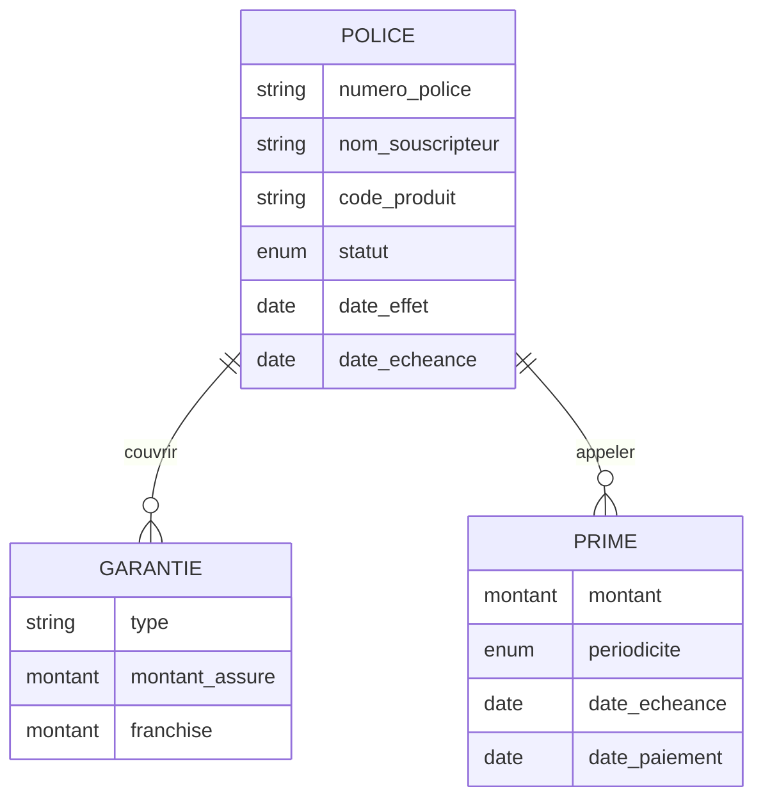

# MCD — Modèle Conceptuel de Données

The MCD is the **purely conceptual level** (Merise methodology). It describes *what* the business needs to remember, independently of any database technology. No primary keys, no foreign keys, no SQL types — only business entities, their attributes, and the associations between them.

## Entities

| Entity | French name | Role |
|---|---|---|
| **POLICE** | Police d'assurance | The insurance contract between the company and the policyholder |
| **GARANTIE** | Garantie | A specific coverage included in the policy (what risk is covered and up to what amount) |
| **PRIME** | Prime | A payment instalment due on the policy |

## Diagram

## Reading the cardinalities

| Notation | Meaning |
|---|---|
| `\|\|` on POLICE side | One and only one POLICE per GARANTIE / PRIME |
| `o{` on GARANTIE / PRIME side | Zero or more (a policy can have none yet, or many) |

**POLICE — couvrir — GARANTIE**
A policy covers one or more guarantees. A guarantee belongs to exactly one policy.

**POLICE — appeler — PRIME**
A policy calls for one or more premium instalments. A premium belongs to exactly one policy.

## Business rules captured

- `statut` ∈ `(brouillon | actif | suspendu | résilié)`
- `date_effet` &lt; `date_echeance` (enforced at both domain and DB level)
- `montant_assure` &gt; 0 — you cannot insure for zero
- `franchise` ≥ 0 — deductible can be zero (full coverage)
- `montant` (prime) &gt; 0 — a premium must have a positive amount
- `periodicite` ∈ `(mensuelle | trimestrielle | annuelle)`
- `date_paiement` is optional — null means the premium has not been paid yet
