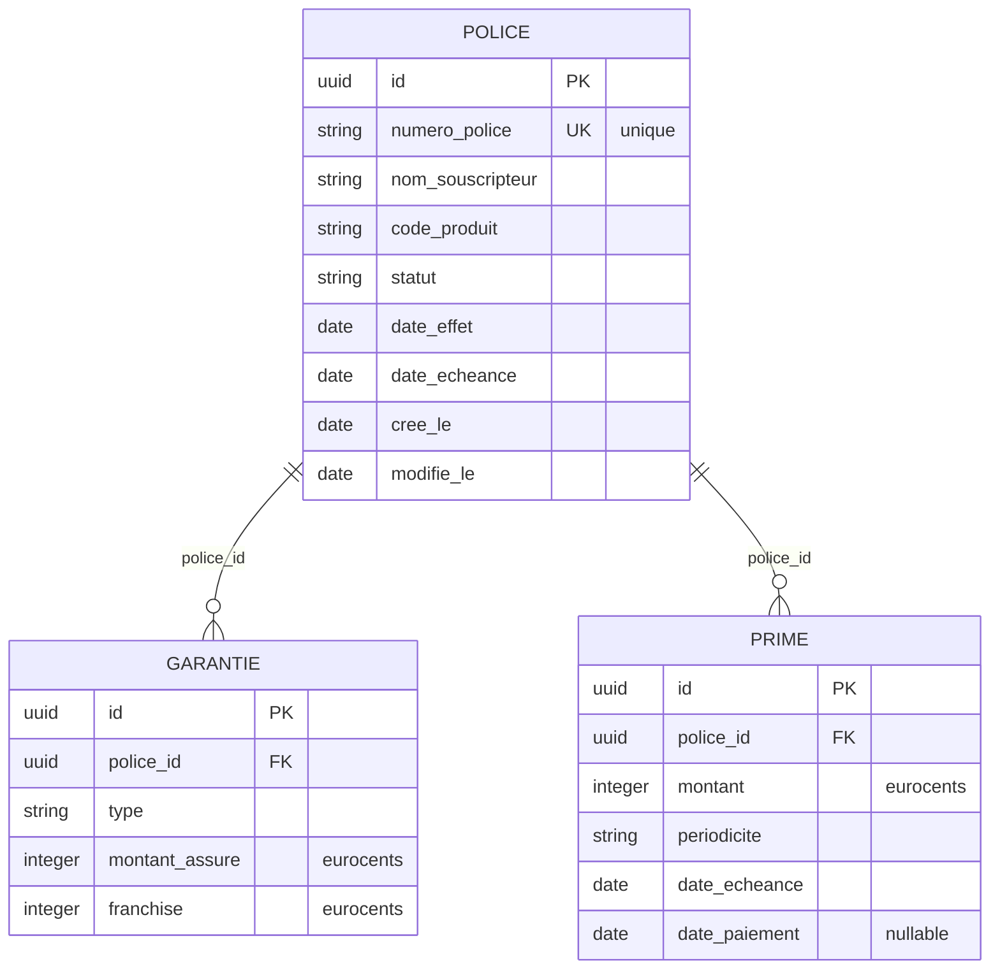

# MLD — Modèle Logique de Données

The MLD translates the MCD into **relations (tables)**. At this level, we identify primary keys, foreign keys, and use logical types — but we are still independent of a specific database engine (PostgreSQL, MySQL, SQLite all look the same here).

## Translation rules applied

| MCD construct | MLD result |
|---|---|
| Entity | Relation (table) |
| Entity identifier | Primary key (PK) |
| Association 1,1 — 0,n | FK in the 0,n side relation |
| Association attribute | Column in the junction table |
| Binary (montant) | Integer (stored as cents — no floating point) |

## Diagram

## Key decisions

**Surrogate keys (UUID)**
Natural candidate for POLICE would be `numero_police`, but UUIDs are used as PKs to decouple the business identifier from the technical identity. `numero_police` is kept as a unique business key.

**Monetary amounts as integers**
`montant_assure`, `franchise`, `montant` are stored as integers representing **eurocents** (1 € = 100). This avoids all floating-point arithmetic errors in financial calculations. Go's `int64` maps directly.

**`date_paiement` nullable**
A `NULL` value means the premium has not been paid. A non-null value is the timestamp of payment. This is preferable to a boolean `paye` + separate `date_paiement` because the timestamp IS the truth — no redundancy.

**No junction table**
Because both associations are 1,1 — 0,n, the FK is simply added to the dependent side (GARANTIE and PRIME). A junction table would only be needed for n,n associations.
