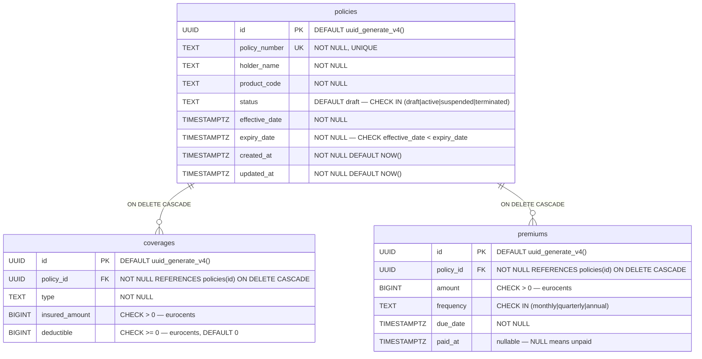

# MPD — Modèle Physique de Données

The MPD is the **PostgreSQL implementation** of the MLD. It specifies exact column types, constraints, defaults, and indexes. This is what is actually executed as `db/migrations/V1__init_schema.sql`.

## Diagram



## Migration file

```sql title="db/migrations/V1__init_schema.sql"
CREATE EXTENSION IF NOT EXISTS "uuid-ossp";

CREATE TABLE policies (
    id             UUID        PRIMARY KEY DEFAULT uuid_generate_v4(),
    policy_number  TEXT        NOT NULL UNIQUE,
    holder_name    TEXT        NOT NULL,
    product_code   TEXT        NOT NULL,
    status         TEXT        NOT NULL DEFAULT 'draft',
    effective_date TIMESTAMPTZ NOT NULL,
    expiry_date    TIMESTAMPTZ NOT NULL,
    created_at     TIMESTAMPTZ NOT NULL DEFAULT NOW(),
    updated_at     TIMESTAMPTZ NOT NULL DEFAULT NOW(),
    CONSTRAINT chk_policy_dates  CHECK (effective_date < expiry_date),
    CONSTRAINT chk_policy_status CHECK (status IN ('draft','active','suspended','terminated'))
);

CREATE TABLE coverages (
    id             UUID   PRIMARY KEY DEFAULT uuid_generate_v4(),
    policy_id      UUID   NOT NULL REFERENCES policies(id) ON DELETE CASCADE,
    type           TEXT   NOT NULL,
    insured_amount BIGINT NOT NULL,
    deductible     BIGINT NOT NULL DEFAULT 0,
    CONSTRAINT chk_insured_amount CHECK (insured_amount > 0),
    CONSTRAINT chk_deductible     CHECK (deductible >= 0)
);

CREATE TABLE premiums (
    id        UUID        PRIMARY KEY DEFAULT uuid_generate_v4(),
    policy_id UUID        NOT NULL REFERENCES policies(id) ON DELETE CASCADE,
    amount    BIGINT      NOT NULL,
    frequency TEXT        NOT NULL,
    due_date  TIMESTAMPTZ NOT NULL,
    paid_at   TIMESTAMPTZ,
    CONSTRAINT chk_premium_amount    CHECK (amount > 0),
    CONSTRAINT chk_premium_frequency CHECK (frequency IN ('monthly','quarterly','annual'))
);

CREATE INDEX idx_policies_status        ON policies(status);
CREATE INDEX idx_policies_policy_number ON policies(policy_number);
CREATE INDEX idx_coverages_policy_id    ON coverages(policy_id);
CREATE INDEX idx_premiums_policy_id     ON premiums(policy_id);
CREATE INDEX idx_premiums_due_date      ON premiums(due_date);
```

## Design notes

**`ON DELETE CASCADE`**
Deleting a policy removes all its coverages and premiums. This is correct: coverages and premiums have no independent existence. A soft-delete pattern (status = 'terminated') is used for business logic; hard deletes are only for data cleanup.

**`uuid-ossp` extension**
PostgreSQL's built-in `gen_random_uuid()` (v13+) could replace `uuid_generate_v4()`, but `uuid-ossp` is chosen for compatibility with older PostgreSQL images in the cluster.

**`TIMESTAMPTZ` vs `TIMESTAMP`**
`TIMESTAMPTZ` stores UTC and handles timezone conversion automatically. Always use `TIMESTAMPTZ` for any date that represents a point in time. `effective_date` and `expiry_date` use `TIMESTAMPTZ` even though they are "business dates" — this avoids DST edge cases on policy boundaries.

**Indexes**
- `idx_policies_status` — most list queries filter by status (active policies)
- `idx_policies_policy_number` — lookup by business key (API GET by number)
- `idx_coverages_policy_id` / `idx_premiums_policy_id` — join performance
- `idx_premiums_due_date` — future: find all premiums due this month

## Go ↔ PostgreSQL type mapping

| Go type | PostgreSQL type | Notes |
|---|---|---|
| `uuid.UUID` | `UUID` | pgx handles natively |
| `string` | `TEXT` | |
| `domain.PolicyStatus` (string) | `TEXT` + CHECK | |
| `int64` | `BIGINT` | eurocents — no float |
| `time.Time` | `TIMESTAMPTZ` | pgx converts to UTC |
| `*time.Time` | `TIMESTAMPTZ` nullable | NULL when not paid |
